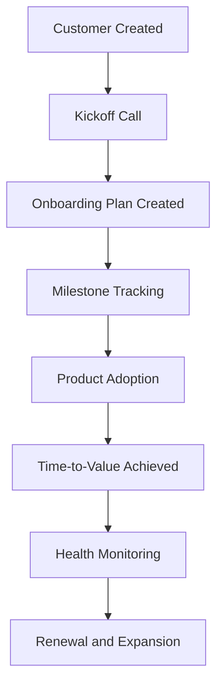

# Customer Success TTV Platform

A Customer Success SaaS platform designed to help Customer Success teams accelerate onboarding, improve customer adoption, and reduce Time-to-Value (TTV) through structured onboarding management and proactive customer success workflows.

---

## Project Vision

Help Customer Success teams identify onboarding risks early, improve customer adoption, and drive faster business outcomes through milestone tracking, onboarding visibility, and customer health insights.

---

## Customer Journey



---

## Status

Sprint 1 Ready – Solution Design Phase

---

## Completed: Sprint 0 – Product Discovery & Planning ✅

### Deliverables

* Product Requirements Document (PRD)
* Customer Personas
* Customer Journey Mapping
* MVP Feature Prioritization
* Product Roadmap

### Key Personas

* Customer Success Manager
* Customer Success Director
* Enterprise Customer

### MVP Scope

* Customer Management
* Onboarding Plan Management
* Milestone Tracking
* Time-to-Value Tracking
* Customer Dashboard

---

## Documentation

| Document        | Description                   |
| --------------- | ----------------------------- |
| PRD.md          | Product Requirements Document |
| personas.md     | Customer Persona Definitions  |
| user-journey.md | Customer Journey Mapping      |
| mvp-features.md | MVP Scope & Product Roadmap   |

---

## Project Structure

```text
customer-success-ttv-platform

docs/
├── PRD.md
├── personas.md
├── user-journey.md
├── mvp-features.md

frontend/
backend/
database/
assets/
```

---

## Upcoming Sprint

### Sprint 1 – Solution Design

Planned Deliverables:

* System Architecture Diagram
* Database Schema Design
* Dashboard Wireframes
* Screen Inventory
* API Planning

---

## Product Roadmap

### Phase 1 – MVP

* Customer Management
* Onboarding Plans
* Milestone Tracking
* Time-to-Value Dashboard

### Phase 2

* Customer Health Score
* Risk Alerts
* Adoption Analytics

### Phase 3

* AI Customer Success Assistant
* Executive Reporting
* Expansion Opportunity Tracking

---

## Long-Term Goal

Build a production-ready Customer Success platform capable of helping SaaS organizations improve onboarding efficiency, increase product adoption, reduce churn risk, and accelerate customer value realization.
