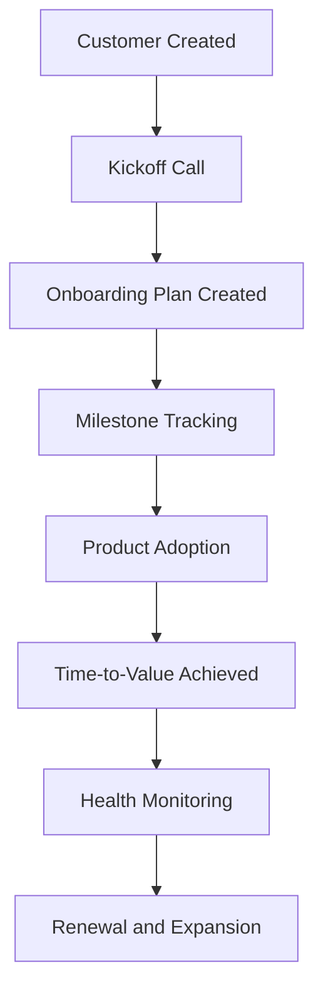

# Customer Success TTV Platform

A Customer Success SaaS platform designed to help Customer Success teams accelerate onboarding, improve customer adoption, and reduce Time-to-Value (TTV) through structured onboarding management and proactive customer success workflows.

---

## Project Vision

Help Customer Success teams identify onboarding risks early, improve customer adoption, and drive faster business outcomes through milestone tracking, onboarding visibility, and customer health insights.

---

## Customer Journey



---

## Status

✅ Sprint 2 Completed – Customer Management Backend

---

## Completed: Sprint 0 – Product Discovery & Planning ✅

### Deliverables

* Product Requirements Document (PRD)
* Customer Personas
* Customer Journey Mapping
* MVP Feature Prioritization
* Product Roadmap

### Key Personas

* Customer Success Manager
* Customer Success Director
* Enterprise Customer

### MVP Scope

* Customer Management
* Onboarding Plan Management
* Milestone Tracking
* Time-to-Value Tracking
* Customer Dashboard

---

## Completed: Sprint 1 – Solution Design & Backend Foundation ✅

### Deliverables

* System Architecture
* Database Schema Design
* API Design
* FastAPI Backend Initialization
* Backend Project Structure
* Environment Configuration
* Interactive API Documentation (Swagger UI)

### Backend Foundation

* FastAPI
* PostgreSQL
* SQLAlchemy
* Python Virtual Environment
* REST API Foundation
* Swagger / OpenAPI Documentation

---

## Documentation

### Product Discovery

* [Product Requirements Document](docs/PRD.md)
* [Customer Personas](docs/personas.md)
* [Customer Journey Map](docs/user-journey.md)
* [MVP Features & Roadmap](docs/mvp-features.md)

### Solution Design

* [System Architecture](docs/system-architecture.md)
* [Database Schema](docs/database-schema.md)
* [API Design](docs/api-design.md)

---

## Project Structure

```text
customer-success-ttv-platform

assets/
└── diagrams/

backend/
├── app/
├── venv/
├── requirements.txt
├── .env.example
└── .gitignore

database/

docs/
├── PRD.md
├── personas.md
├── user-journey.md
├── mvp-features.md
├── system-architecture.md
├── database-schema.md
└── api-design.md

frontend/
```

---

## Completed: Sprint 2 – Customer Management Backend ✅

### Deliverables

* PostgreSQL Integration
* SQLAlchemy Database Models
* Customer API
* Create Customer Endpoint
* Customer Validation using Pydantic
* Dependency Injection
* Database Persistence
* Swagger API Testing

### Technologies Used

* FastAPI
* PostgreSQL
* SQLAlchemy ORM
* Pydantic
* Swagger UI / OpenAPI
* Git
* GitHub

---

## Product Roadmap

### Phase 1 – MVP

* Customer Management
* Onboarding Plans
* Milestone Tracking
* Time-to-Value Dashboard

### Phase 2

* Customer Health Score
* Risk Alerts
* Adoption Analytics

### Phase 3

* AI Customer Success Assistant
* Executive Reporting
* Expansion Opportunity Tracking

---

## Long-Term Goal

Build a production-ready Customer Success platform capable of helping SaaS organizations improve onboarding efficiency, increase product adoption, reduce churn risk, and accelerate customer value realization.
