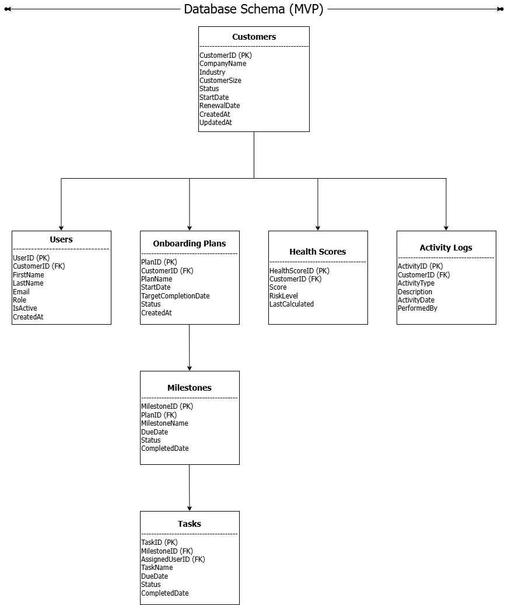

# Database Schema

## Overview

The Customer Success TTV Platform uses a relational PostgreSQL database to store customer, onboarding, milestone, task, health score, and activity information. The schema is designed to support the MVP while remaining extensible for future AI capabilities and third-party integrations.

## Database Schema Diagram

## Core Entities

### Customers
Stores information about customer organizations using the platform.

### Users
Stores Customer Success Managers and customer users associated with a customer account.

### Onboarding Plans
Represents onboarding programs created for customers.

### Milestones
Tracks major onboarding objectives within an onboarding plan.

### Tasks
Stores individual tasks required to complete each milestone.

### Health Scores
Stores customer health metrics used to monitor customer success.

### Activity Logs
Maintains an audit trail of customer activities and important events.

## Entity Relationships

- One Customer can have multiple Users.
- One Customer can have multiple Onboarding Plans.
- One Customer can have multiple Health Score records.
- One Customer can have multiple Activity Logs.
- One Onboarding Plan can contain multiple Milestones.
- One Milestone can contain multiple Tasks.

## Design Principles

- Normalized relational database design
- Primary and Foreign Keys maintain data integrity
- Optimized for Customer Success workflows
- Scalable for future AI-driven recommendations
- Designed for future Salesforce and third-party integrations

## Future Enhancements

Future versions of the platform may introduce:

- Multi-tenant Organizations
- Role & Permission tables
- AI Recommendation history
- Notifications
- Email history
- CRM synchronization logs

## Summary

The database schema provides a scalable foundation for managing customer onboarding, milestone tracking, customer health, and operational workflows while supporting future platform expansion.