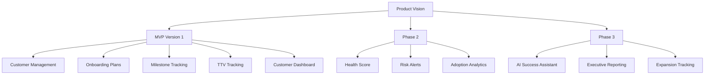

# MVP Feature Prioritization

## Product Vision

Help Customer Success teams accelerate customer onboarding, improve adoption, and reduce Time-to-Value through structured onboarding management and progress visibility.

## Product Roadmap

---

# MVP Features (Version 1)

These features are required for the first working version of the platform.

## 1. Customer Management

### Description

Create and manage customer accounts.

### Key Capabilities

* Create customer records
* Store account details
* Assign Customer Success Manager
* View customer profile

### Business Value

Provides a centralized customer record system.

---

## 2. Onboarding Plan Management

### Description

Create onboarding plans for customers.

### Key Capabilities

* Create onboarding plans
* Assign onboarding milestones
* Define target completion dates

### Business Value

Creates a structured onboarding process.

---

## 3. Milestone Tracking

### Description

Track onboarding progress against milestones.

### Key Capabilities

* Mark milestones complete
* Track progress percentage
* Highlight overdue milestones

### Business Value

Improves visibility into onboarding status.

---

## 4. Time-to-Value Tracking

### Description

Measure how quickly customers achieve value.

### Key Capabilities

* Track onboarding start date
* Track value achievement date
* Calculate TTV automatically

### Business Value

Measures onboarding effectiveness.

---

## 5. Customer Dashboard

### Description

Provide visibility into onboarding performance.

### Key Capabilities

* Customer overview
* Progress tracking
* TTV metrics
* Upcoming milestones

### Business Value

Improves decision making for CSMs.

---

# Phase 2 Features

## Customer Health Score

* Health score calculation
* Risk indicators
* Health trend monitoring

## Risk Alerts

* Overdue milestone alerts
* Low adoption alerts
* Risk notifications

## Adoption Analytics

* Feature adoption tracking
* Usage reporting

---

# Phase 3 Features

## AI Customer Success Assistant

* AI-generated account summaries
* Recommended next actions
* Customer risk explanations

## Executive Reporting

* Portfolio health dashboard
* Team performance reporting

## Expansion Opportunity Tracking

* Growth opportunity identification
* Expansion pipeline management

---

# Out of Scope (Current Project)

* Billing
* Contracts
* Payments
* CRM Integrations
* Email Marketing Automation
* Multi-tenant Architecture
