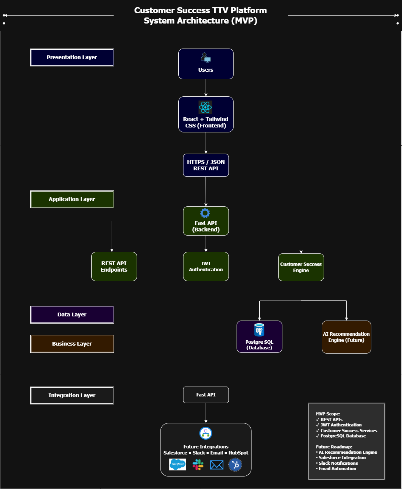

# System Architecture

## Overview

The Customer Success TTV Platform follows a layered SaaS architecture designed for scalability, maintainability, and future AI-driven enhancements. The platform separates responsibilities into Presentation, Application, Business, Data, and Integration layers to ensure clean architecture and simplify future expansion.

## System Architecture Diagram

## Architecture Principles

- Layered architecture with clear separation of responsibilities
- REST-based communication between frontend and backend
- Stateless backend services using FastAPI
- Centralized PostgreSQL database
- Modular design for future integrations and AI capabilities
- Scalable and cloud-ready architecture

## Technology Stack

| Layer | Technology |
|--------|------------|
| Frontend | React, Tailwind CSS |
| Backend | FastAPI (Python) |
| Database | PostgreSQL |
| API Communication | REST APIs (JSON over HTTPS) |
| Authentication | JWT |
| Diagrams | Draw.io |
| Version Control | Git & GitHub |

## Architecture Layers

### Presentation Layer

Provides the user interface for Customer Success Managers to manage onboarding, monitor customer health, and track Time-to-Value.

### Application Layer

The Application Layer contains the FastAPI backend, REST API layer, JWT authentication, and Customer Success Services. It processes incoming requests, executes business operations, and communicates with the data layer.

### Business Layer

The Business Layer hosts the AI Recommendation Engine (Future), which will analyze customer data to generate proactive recommendations, identify risks, and suggest next-best actions for Customer Success Managers.

### Data Layer

Stores customer, onboarding, milestone, task, health score, and application data in PostgreSQL.

### Integration Layer

Designed for future integrations with Salesforce, Slack, Email services, and HubSpot.

## Design Decisions

- FastAPI selected for its performance and simplicity.
- React provides a modern component-based frontend.
- PostgreSQL offers reliable relational data storage.
- JWT enables secure stateless authentication.
- AI capabilities are intentionally separated to support future expansion without affecting the MVP.

## Future Scalability

The architecture supports future enhancements including:

- AI-powered customer recommendations
- Salesforce CRM synchronization
- Slack notifications
- Email automation
- Advanced analytics dashboards
- Multi-tenant architecture

## Summary

The architecture provides a scalable foundation for building a modern Customer Success SaaS platform while maintaining clear separation between presentation, application, business, data, and integration concerns.