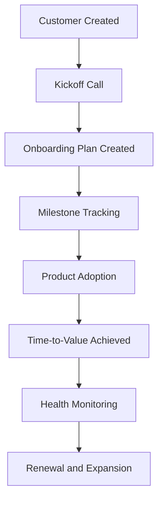

# Customer Journey Map

## Journey Overview

This journey represents the lifecycle of an enterprise customer from onboarding through adoption, value realization, and renewal.

## Customer Journey Flow

---

## Stage 1: Customer Created

### Customer Goal

Begin implementation and understand onboarding expectations.

### CSM Goal

Capture customer information and create an onboarding plan.

### Risks

* Incomplete customer information
* Delayed kickoff

### Metrics

* Days to Kickoff
* Onboarding Start Date

---

## Stage 2: Kickoff Call

### Customer Goal

Understand implementation timeline and expected outcomes.

### CSM Goal

Align stakeholders, define milestones, and establish success criteria.

### Risks

* Misaligned expectations
* Missing stakeholders

### Metrics

* Stakeholder Participation
* Success Plan Completion

---

## Stage 3: Onboarding Plan Created

### Customer Goal

Gain visibility into implementation tasks and timelines.

### CSM Goal

Assign onboarding milestones and track progress.

### Risks

* Undefined milestones
* Delayed task ownership

### Metrics

* Milestones Created
* Milestone Completion %

---

## Stage 4: Product Adoption

### Customer Goal

Begin using core product features.

### CSM Goal

Drive feature adoption and user engagement.

### Risks

* Low engagement
* Poor adoption

### Metrics

* Feature Adoption Rate
* Active Users
* Usage Frequency

---

## Stage 5: Time-to-Value Achieved

### Customer Goal

Realize measurable business value.

### CSM Goal

Validate customer outcomes and document success.

### Risks

* Delayed outcomes
* Unclear value realization

### Metrics

* Time-to-Value (Days)
* Business Outcomes Achieved

---

## Stage 6: Health Monitoring

### Customer Goal

Continue receiving value from the platform.

### CSM Goal

Monitor account health and identify risks.

### Risks

* Declining engagement
* Support issues

### Metrics

* Health Score
* Product Usage
* Support Tickets

---

## Stage 7: Renewal & Expansion

### Customer Goal

Continue partnership and maximize value.

### CSM Goal

Drive renewals and identify growth opportunities.

### Risks

* Renewal risk
* Competitive threats

### Metrics

* Renewal Rate
* Expansion Opportunities
* Customer Satisfaction

